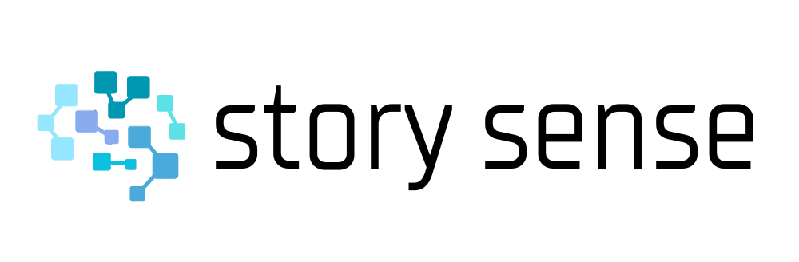

# Final Year Project in Computer Science

### Project title : Estimating Story Points in Scrum: Balancing Accuracy and Interpretability with Explainable AI

This repository provides the code used for training, evaluating and XAI methods for my research project.

Key Components:

- **Datasets**: The datasets folder contains the 3 datasets used in this study. These datasets are available to anyone in order to facilitate further research in story point estimation.

- **Code**: The classes folder houses all the code segments used for various aspects of this research:
   - Data preprocessing steps to prepare the text data for model training.
   - Training scripts for different machine learning models for story point prediction.
   - Code for XAI methods that provide insights into model predictions.

- **Results**: The results folder includes both:
  - Human-based evaluations on the accuracy outputs and XAI explanations, providing qualitative insights into how the models perform.
  - Individual results for each model and XAI method used, detailing specific accuracy metrics and interpretability analyses.
